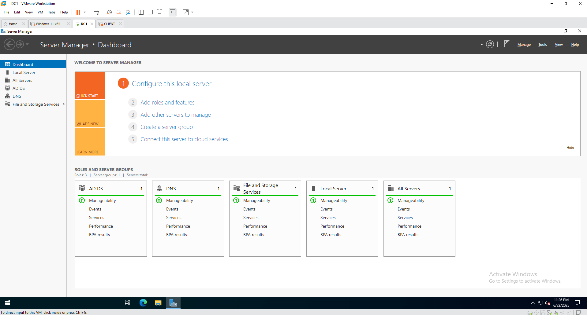
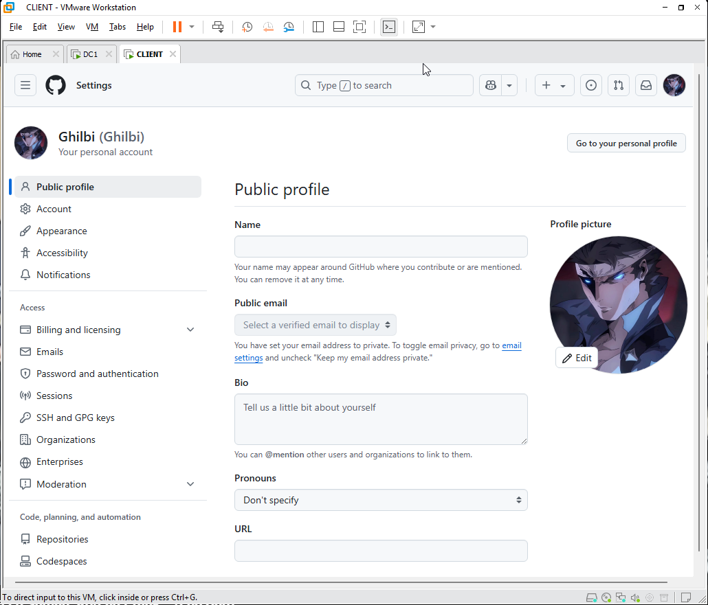
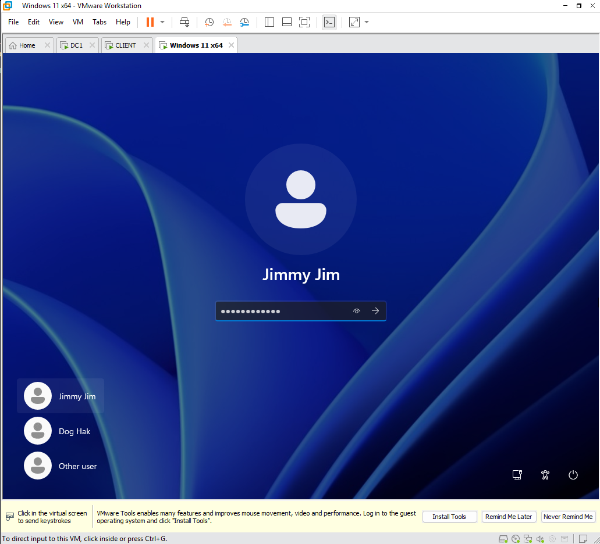
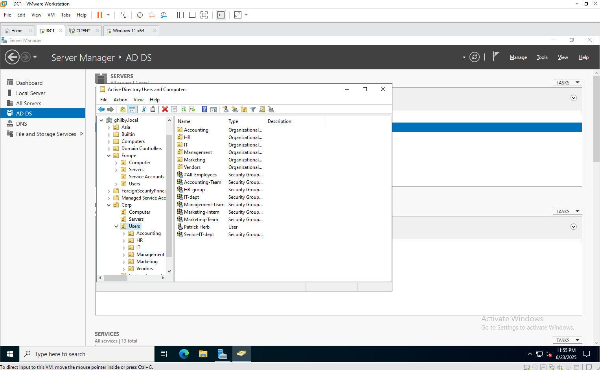

# Active Directory Server Documentation

This repository documents an existing Active Directory (AD) server setup on Windows Server 2022, hosted in a VMware environment. The configuration includes Group Policy Management, File Services, Service Accounts, Single Purpose Computers, Windows File Sharing (NTFS and Shared), Effective Permissions and Inheritance, and Access-Based Enumeration (ABE). The environment consists of one Windows Server 2022 VM and two Windows 11 client VMs.

## Table of Contents
1. [Overview](#overview)
2. [Environment Details](#environment-details)
3. [Active Directory Structure](#active-directory-structure)
4. [Group Policy Management](#group-policy-management)
5. [File Services](#file-services)
6. [Service Accounts](#service-accounts)
8. [Windows File Sharing](#windows-file-sharing)
8. [Access-Based Enumeration](#access-based-enumeration) 
9. [Contributing](#contributing)
10. [Closing](#closing-statement)

## Overview
This documentation captures the configuration of a lightweight AD environment for managing users, groups, and resources in a lab setup. Key features include:
  - **Group Policy Management**: Centralized user and computer settings.
  - **File Services**: Shared file storage.
  - **Service Accounts**: Accounts for running services securely.
  - **Single Purpose Computers**: Restricted client for specific tasks.
  - **Windows File Sharing**: NTFS and share permissions for secure access.
  - **Effective Permissions and Inheritance**: Granular access control.
  - **Access-Based Enumeration**: Hides folders from unauthorized users.

## Learning Objectives
  By exploring this Active Directory lab setup, you will:
  - Understand the installation and configuration of Active Directory Domain Services (AD DS) on Windows Server 2022.
  - Learn to create and manage Organizational Units (OUs), users, and groups in ADUC.
  - Gain proficiency in configuring Group Policy Objects (GPOs) to enforce security and user experience settings.
  - Develop skills in setting up and securing file shares using NTFS permissions, share permissions, and Access-Based Enumeration.
  - Explore the use of service accounts for running automated tasks securely.
  - Configure and test a single-purpose computer with restricted functionality using AppLocker or similar tools.
  - Master the concepts of effective permissions and permission inheritance in NTFS file systems.
  - Practice troubleshooting common AD issues, such as DNS misconfigurations and GPO application failures.
  
## Environment Details
- **Hypervisor**: VMware Workstation/Player
- **Server VM**:
  - OS: Windows Server 2022
  - RAM: 4 GB
  - Disk: 60 GB
  - IP Address: 192.168.108.132
  - Hostname: [DC1]
- **Client VM 1 (Security Accounts/Single Purpose)**:
  - OS: Windows 11 Pro
  - RAM: 4 GB
  - Disk: 62 GB
  - IP Address: Dynamic
  - DNS: 192.168.108.132
  - Hostname: [CLIENT1]
- **Client VM 2 (General Client)**:
  - OS: Windows 11 Pro
  - RAM: 4 GB
  - Disk: 62 GB
  - IP Address: Dynamic
  - DNS: 192.168.108.132
  - Hostname: [CLIENT2]
- **Network**: Internal network (NAT/Host-Only)
- **Domain**: [ghilby.local]

## Active Directory Structure
- **Domain**: [ghilby.local]
- **Organizational Units (OUs)**:
  - [Corp - Computer, Servers, Users - Accounting, HR, IT, Managment, Marketing, and Vendors, Service Accounts]
  - Main OU is Corp under this OU Computer which has both client computers, Servers which is currently empty, and Users where deparmental groups are created also in this OU are the OUs of each department Accounting, HR, IT, Managment, Marketing, Vendors which includes the users. Service Accounts OU is for the single purpose desktop.
- **Groups**:
  - [#all-employees, Accounting-Team, HR-group, IT-dept, Management-team, Marketing-intern, Marketing-Team, Seniot-IT-dept]
  - [#all-employees - where all users are members. all Security Groups have at least 2 users assigned to them which is created manually]

## Group Policy Management
- **GPOs Configured**:
  - [Account Lockout Policy, Desktop Wallpaper, Disable USB devices, Mapped Drives, Password Policy, Restrict Control Panel, Restrict Logon to Service Account]
  - [All these GPOs are linked to the domain and the Corp OU]

## File Services
- **File Server Role**: Installed
- **Shared Folders**:

  

  - HRGroup: HR-Group can only access
  - Marketing: Marketing-Team has full access but Marketing-intern only has read access
  - SHARED: #all-employees have full access
  - Sofware: IT-dept have full acces but inside this folder Licenses which only Senior-IT-dept has full access
  - VendorFiles: Third party users outside can write but not access

## Service Accounts
- **Accounts**:
  - [Website Login]
  - Only for single purpose desktops
    
- **Permissions**:
  - Instant Login, Automatically opens application on startup this service account is for a kiosk type.
  - Other users except for the Service Account cannot login to this PC.
- **Usage**:
    [As for my case it displays my Github profile on startup]

## Windows File Sharing
- **NTFS Permissions**:
  - **HRGroup**

    
  - **Marketing**

    
  - **SHARED**

    
  - **Licences**

    

- **Share Permissions**:
  - **HRGroup**

    
  - **Marketing**

    
  - **SHARED**

    
  - **Software**

    

- **Access Paths**:
  - \\WIN-FOQSSNIORHO\HRGroup
  - \\WIN-FOQSSNIORHO\Marketing
  - \\WIN-FOQSSNIORHO\SHARED
  - \\WIN-FOQSSNIORHO\Sofware
  - \\WIN-FOQSSNIORHO\Software\Licenses

## Access-Based Enumeration
- **Status**: Enabled
- **Behavior**:
  - Users without permissions cannot see subfolders
- **Configuration**:
  - ABE is applied on all folders
- **Example**
  - Logged in to user "Jimmy Jim" which is a member of the IT-dept, he can't access nor see the Licenses folder inside the Software folder
    

## Contributing
Contributions to improve this documentation are welcome. Submit issues or pull requests on GitHub.

## Closing Statement
This documentation provides a comprehensive overview of the Active Directory server setup, capturing its configuration and functionality for educational and reference purposes. It serves as a foundation for understanding and managing the lab environment, with detailed insights into Group Policy, file sharing, and security features. Feel free to explore, test, or contribute to enhance this setup further!
